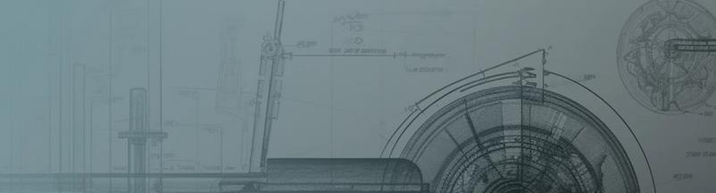

# Инженер-конструктор

## О себе
Инженер-конструктор с опытом разработки металлоконструкций и узлов машин.
Работаю с 3D-моделями, чертежами, расчётами прочности.

## Навыки
- Проектирование металлоконструкций
- 3D-моделирование
- Подготовка КД
- Технические расчёты

## Инструменты
- AutoCAD
- SolidWorks
- Autodesk Inventor
- Excel (расчёты)

## Проекты
⬇️ Ниже представлены примеры моих работ с описаниями и файлами.

<!--
**pavel-burakov-engineer/pavel-burakov-engineer** is a ✨ _special_ ✨ repository because its `README.md` (this file) appears on your GitHub profile.

Here are some ideas to get you started:

- 🔭 I’m currently working on ...
- 🌱 I’m currently learning ...
- 👯 I’m looking to collaborate on ...
- 🤔 I’m looking for help with ...
- 💬 Ask me about ...
- 📫 How to reach me: ...
- 😄 Pronouns: ...
- ⚡ Fun fact: ...
-->
